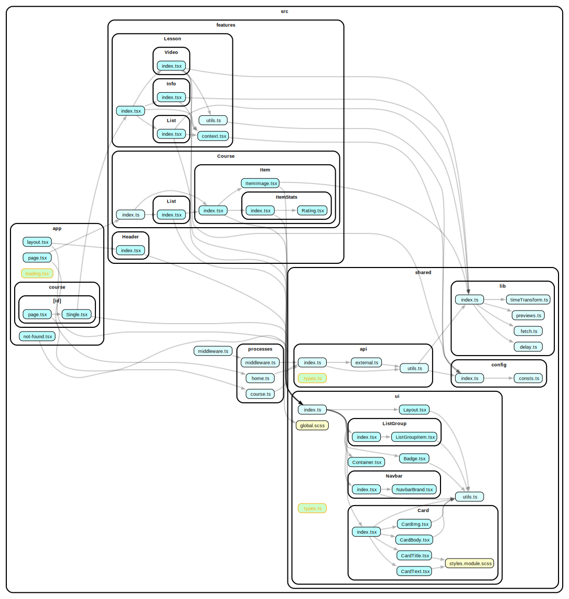
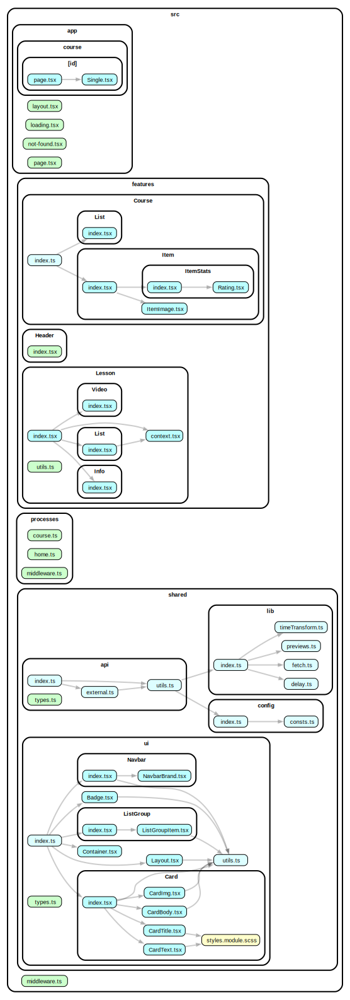

[](https://classroom.github.com/a/_2xjYeZK)

# Genesis Case

Case requirements defined [here](https://mixolydian-polonium-8c0.notion.site/Front-End-School-2-0-c0a2ae89311645e2bdd48b770868ba09).

## Getting Started

> **Note:** To simplify local deployment file .env is removed from .gitignore

### Cloning the repo

```bash
git clone git@github.com:perhamik/genesis-case.git perhamik-genesis-case
cd perhamik-genesis-case
```

### Running locally

#### Using docker:

```bash
docker build -t hw-1 . && docker run --name perhamik-case -dp 3000:3000 hw-3
# OR through yarn
yarn docker
```

#### Using yarn:

```bash
yarn install && yarn dev
```

Open [http://localhost:3000](http://localhost:3000) with your browser to see the result.

## Project structure

```bash
│
├─── app/ # as pages routing Next.js 13 feature
│     │──── course/
│     │       └──[id]/
│     │            │── page.tsx # Course page content
│     │            └── Single.tsx # Single course component
│     │
│     │── layout.tsx # Home page layout
│     │── loading.tsx # Home page loading content (layout children)
│     │── not-found.tsx # 404 page
│     └── page.tsx # Home page content
│
├─── features/
│     │── Course
│     │       │── Item
│     │       │    │─── ItemStats
│     │       │    │      │─── index.tsx  # display tags, additional info and rating
│     │       │    │      └─── Rating.tsx # rating component
│     │       │    │
│     │       │    │─── index.tsx
│     │       │    └─── ItemImage.tsx # preview of course
│     │       │
│     │       │
│     │       │── List/index.tsx # represents displaying list of courses
│     │       │
│     │       └── index.tsx
│     │
│     │── Header
│     │     └── index.tsx
│     │
│     └─── Lesson
│           │── Info/index.tsx
│           │
│           │── List/index.tsx # list of lessons in course
│           │
│           │── Video/index.tsx
│           │
│           │── context.tsx # local context for Lesson Component
│           │── index.tsx # entry point
│           └── utils.ts # local helpers
│
│
├─── processes/
│     │── course.tsx
│     │── home.tsx
│     └── middleware.tsx
│
├─── shared/
│     │── api/
│     │    │── external.ts # interaction with external API
│     │    │── index.ts
│     │    │── types.ts
│     │    └── utils.ts # local helpers
│     │
│     │── config/
│     │    │── consts.ts
│     │    └── index.ts
│     │
│     │── lib/
│     │    │── delay.ts
│     │    │── fetch.ts
│     │    │── index.ts
│     │    │── previews.ts
│     │    └── timeTransform.ts
│     │
│     │── themes/ # featured soon
│     │
│     └── ui/
│          │── Card/  # Card component
│          │    │── CardBody.tsx
│          │    │── CardImg.tsx
│          │    │── CardText.tsx
│          │    │── CardTitle.tsx
│          │    │── index.tsx
│          │    └── styles.module.scss
│          │
│          │── helpers/ # style helpers
│          │    │── reset.scss
│          │    └── index.scss
│          │
│          │── ListGroup/
│          │    │── index.tsx
│          │    └── ListGroupItem.tsx
│          │
│          │── Navbar/
│          │    │── index.tsx
│          │    └── NavbarBrand.tsx
│          │
│          │── Badge.tsx
│          │── Container.tsx
│          │── global.scss
│          │── index.ts
│          │── Layout.tsx
│          │── types.ts
│          └── utils.ts
│
└──── middleware.ts

```

### Architecture



#### Simplified


